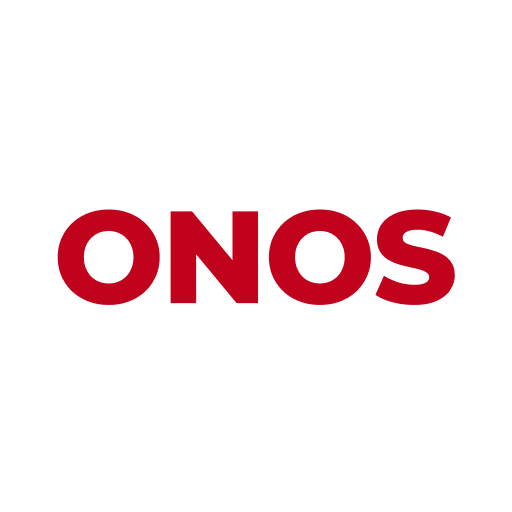

<div align="center">
    
    <h1>ONOS</h1>
    <p><b>A privacy-first AI clinical scribe that runs entirely on your machine.</b></p>
    <p>
        
        
        
    </p>
</div>

---

ONOS records a clinical encounter, transcribes it, and drafts a structured note — with no audio, transcript, or note ever leaving the device. There is no account, no telemetry requirement, and no cloud dependency. Everything runs locally: speech recognition through Whisper, summarization through a local language model.

It was built for ambient documentation of in-person consults, where sending patient conversations to a third-party service is not an option.

## Contents

- [How it works](#how-it-works)
- [Note templates](#note-templates)
- [Installation](#installation)
- [Building from source](#building-from-source)
- [Where your data lives](#where-your-data-lives)
- [Architecture](#architecture)
- [Credits](#credits)

## How it works

**Transcription** runs locally via [whisper.cpp](https://github.com/ggerganov/whisper.cpp). The default model is **Whisper large-v3-turbo** (~1.5 GB), downloaded once on first launch. Whisper is multilingual, covering **97 languages**, so consultations can be conducted in whatever language the patient speaks. Smaller models (`small`, `medium`, `large-v3-q5_0`) and the faster NVIDIA Parakeet engine are selectable in settings — the app switches between engines freely.

**Summarization** runs locally too, through a bundled `llama.cpp` sidecar. The default is **Gemma 3 4B** (~2.5 GB), chosen for note quality; the lighter **Gemma 3 1B** remains selectable in settings for low-memory machines. If you'd rather use a hosted model, Ollama, Claude, OpenAI, Groq, OpenRouter, and any OpenAI-compatible endpoint are all supported — but nothing leaves the machine unless you explicitly choose one.

**Language** defaults to English and remembers whatever you last selected. Whisper supports manual language selection across the full ISO-639-1 set; French is wired through to the note templates.

**GPU acceleration** is automatic: Metal on macOS, CUDA or Vulkan on Windows and Linux, with CPU fallback.

## Note templates

Templates live in [`frontend/src-tauri/templates/`](frontend/src-tauri/templates/) as plain JSON — each defines a set of sections with an instruction and an output format, so adding your own is a matter of copying a file.

| Template | Purpose |
|---|---|
| `geri_consults.json` | Geriatrics consult note — frailty scale, collateral contacts, functional history |
| `consults.json` | General consult note |
| `follow_ups.json` | Follow-up note |
| `*_french.json` | French-language variants of each |

## Installation

No packaged release is published yet — [build from source](#building-from-source) for now. Once builds are posted they will appear under [Releases](https://github.com/NicholasJYee/onos-app/releases).

macOS builds are signed and notarized, so they open normally. Windows builds are currently unsigned and will show a SmartScreen warning — choose **More info → Run anyway**.

## Building from source

Requires [Rust](https://rustup.rs/), Node 20, [pnpm](https://pnpm.io/), and CMake.

```bash
git clone https://github.com/NicholasJYee/onos-app.git
cd onos-app/frontend
pnpm install
pnpm build:mac      # or: pnpm build:win
```

Artifacts land in `target/<triple>/release/bundle/`.

Both scripts pass an explicit `--target`, so macOS and Windows output never share a directory.

<details>
<summary><b>Signing and notarization (macOS)</b></summary>

The signing identity lives in `tauri.conf.json`. Notarization credentials are read from the environment and are never committed:

```bash
export APPLE_API_KEY="<key id>"
export APPLE_API_ISSUER="<issuer id>"
export APPLE_API_KEY_PATH="$HOME/.appstoreconnect/AuthKey_<key id>.p8"
```

With those set, `pnpm build:mac` signs, uploads to Apple, staples the ticket, and packages the `.dmg` in one step. Without them the build still succeeds but skips notarization, producing a `.dmg` that Gatekeeper blocks on other machines.

</details>

<details>
<summary><b>Optional backend</b></summary>

The desktop app is fully standalone. A FastAPI service in [`backend/`](backend/) adds shared meeting storage and server-side summarization for multi-machine setups. See [`backend/README.md`](backend/README.md).

</details>

## Where your data lives

Everything stays on disk, in the clear, under your control.

**macOS**

```
~/Library/Application Support/com.onos.ai/
├── models/                   # Whisper + Gemma weights
├── meeting_minutes.sqlite    # transcripts, notes, settings
└── preferences.json

~/Movies/onos-recordings/     # audio files
```

The recordings folder is configurable — change it under **Settings → Recording** to store audio on an external drive, an encrypted volume, or anywhere else that suits your setup. Existing recordings stay where they are; the new location applies to subsequent recordings.

**Windows**

```
%APPDATA%\com.onos.ai\
%USERPROFILE%\Music\onos-recordings\
```

Deleting the app leaves these in place. Remove them by hand to erase everything.

## Architecture

```
┌──────────────────────── Desktop app (Tauri 2) ────────────────────────┐
│                                                                       │
│   Next.js UI  ←──IPC──→  Rust core  ──→  Whisper  (transcription)     │
│   (React/TS)             (audio,         llama.cpp (summarization)    │
│                           SQLite)                                      │
└───────────────────────────────────────────────────────────────────────┘
```

Audio capture runs two paths off one pipeline: a mixed stream written to disk, and a VAD-filtered stream sent to Whisper — so only speech is transcribed, cutting inference load substantially.

Deeper documentation: [`docs/architecture.md`](docs/architecture.md), [`docs/BUILDING.md`](docs/BUILDING.md), [`docs/GPU_ACCELERATION.md`](docs/GPU_ACCELERATION.md), and [`CLAUDE.md`](CLAUDE.md) for a codebase tour.

## Contributing

Issues and pull requests are welcome. `CONTRIBUTING.md` has the details.

## Credits

ONOS is built on top of **[Meetily](https://github.com/Zackriya-Solutions/meetily)** by [Zackriya Solutions](https://github.com/Zackriya-Solutions) — an open-source, privacy-first meeting assistant. Their work provided the audio pipeline, the local transcription and summarization architecture, and the Tauri application foundation that this project is adapted from. ONOS narrows that general-purpose meeting tool into a clinical documentation workflow.
